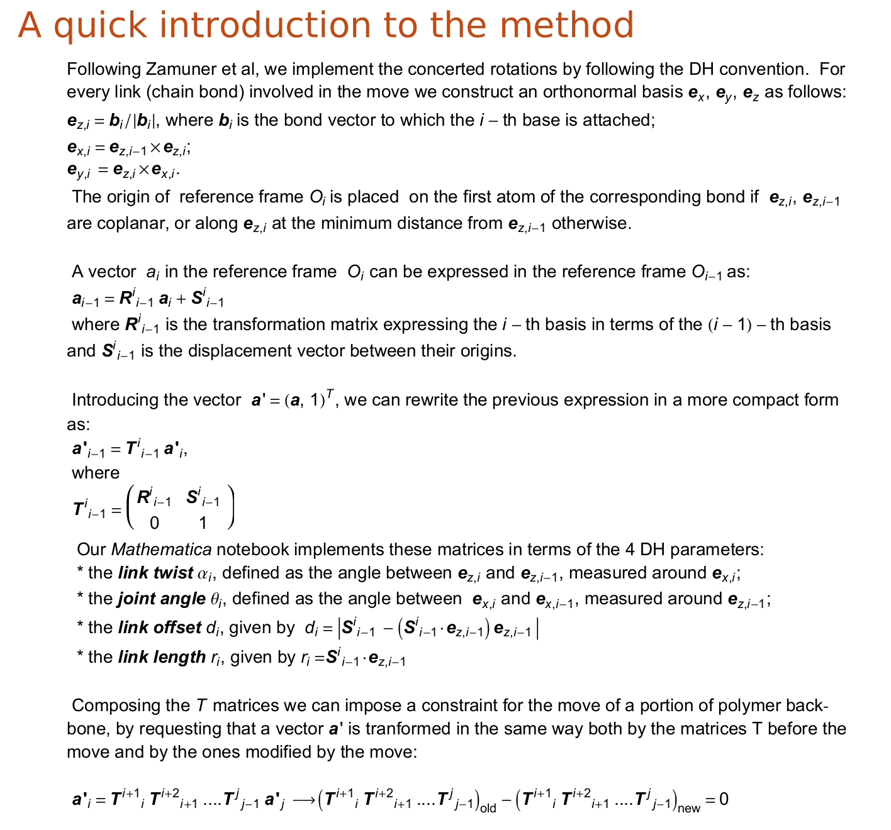
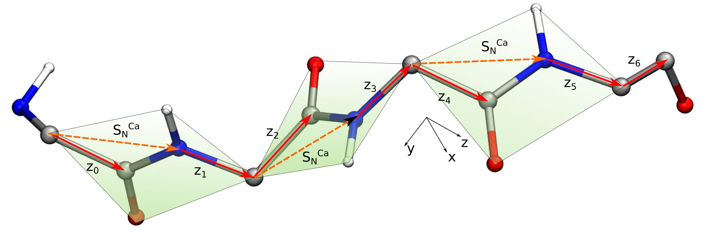
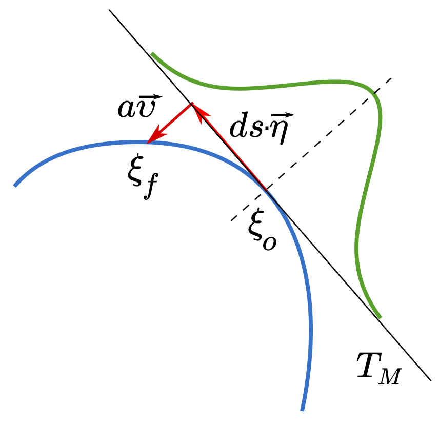
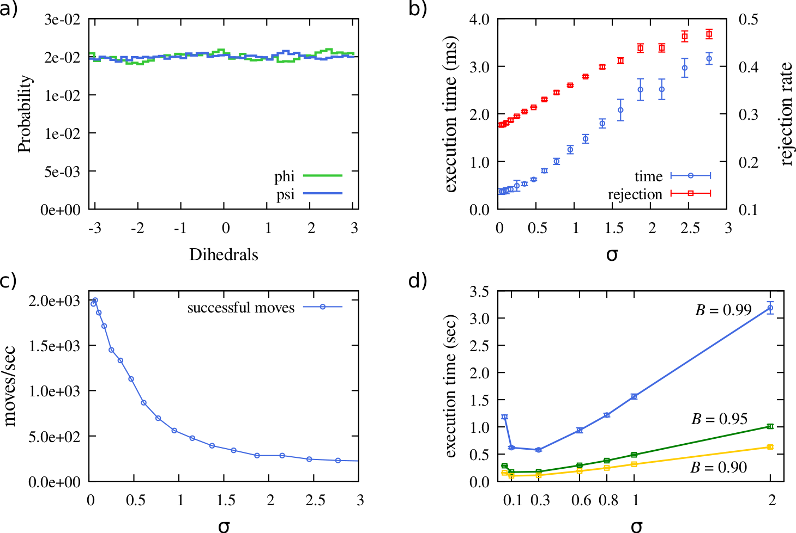
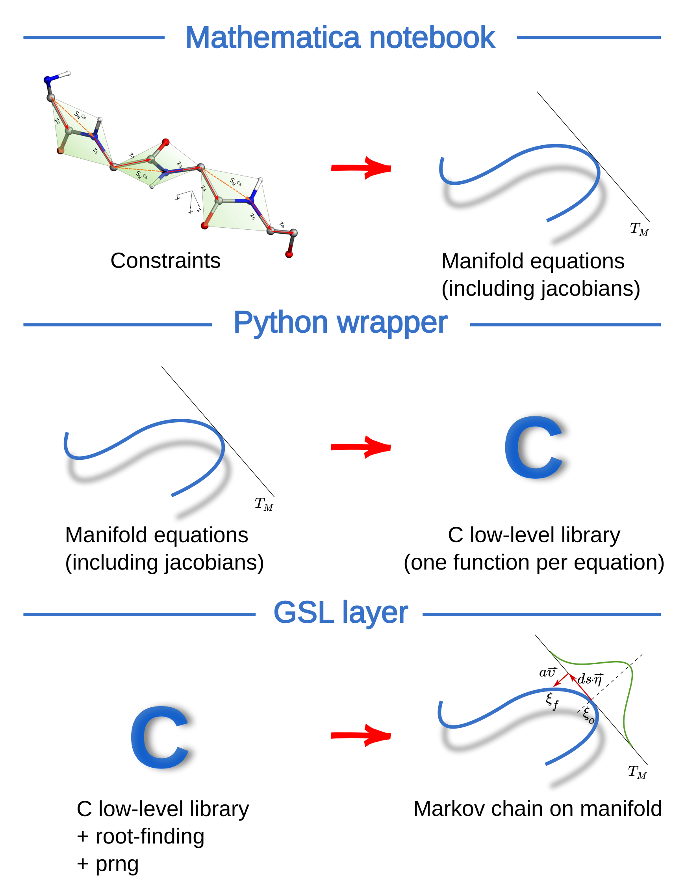

# Concerted rotations of protein backbones using Wolfram Mathematica

This repository contains the source code to generate concerted rotations of a protein backbone using the approach introduced by [Zamuner et al](http://journals.plos.org/plosone/article?id=10.1371/journal.pone.0118342).
In our implementation, the C code is precomputed using Wolfram Mathematica, making it significantly fast. While the library in this repository implements a move of 7 consecutive dihedrals on a protein backbone, the 
user can modify the Mathematica notebook and Python wrapper to use a different set of free variables, or the C source code to reproduce a different backbone. The geometry of the backbone is known to the concerted rotation 
algorithm only through the function which convert the backbone into a series of Denavit-Hartenberg parameters.

  

  
  

  

The figure above provides a graphical example for the concerted rotation of three consecutive residues on a polypeptide chain. This involves seven T matrices. The matrices, the constraint function and the derivatives necessary to define the tangent space to the constraint manifold are obtained in our Mathematica notebook.

## Concerted rotations on a Manifold

The equations reported above allow us identify the constraint manifold corresponding the the condition that the starting and ending point of the moved portion must remain fixed. This gives 6 constraints: 3 for the orientation of the last bond and 3 for its position. If we consider a seventh free variable, we obtain a one dimensional manifold in R^6. 

Zamuner's concerted rotations algorithm basically consists of the following steps.

1. Identify the point on the manifold corresponding to the current backbone configuration.
2. Identify the tangent space to that point, using Dini's theorem.
3. Take a random step on the tangent space. The length of this step is drawn from a gaussian distribution of width sigma.
4. Use a root-finding algorithm to project the the new point on the tangent space back on the manifold. The point so obtained gives us the new backbone configuration. 
5. Accept or reject the move with the correct weight, based on the probability to obtain the backward step.

These steps are represented schematically below.

  

### Impact of the Gaussian distribution width to move efficiency

The gaussian distribution controls the length of the step. Larger values of its width, sigma, allow for longer steps, but also cause a larger rejection rate. As described in our paper, we investigated the effect of different values of sigma on the time necessary to sample the configurational space of a phantom protein backbone. In particular, we considered the time needed to reach a given value of the coefficient B, measuring the convergence to a uniform distribution. The results, reported in the figure below, show that the optimal value of sigma is around 0.2.

  

## Library implementation

The general scheme of our library is reported in the following diagram:

  

## Generating the code

To generate the precompiled code for a generic concerted rotation, open and run the Mathematica notebook 
in folder `Code/generic_move`.

To compile the test program, in folder `Code` run:

`make concerted_rot.x`

Our implementation of the concerted rotations is based on the [Gnu Scientific Library](https://www.gnu.org/software/gsl/), which needs to be installed before compiling the code.

To run the test program:

`./concerted_rot.x aapot`

The test code simulates a phantom protein backbone. Nonetheless, the code can be easily modified to 
sample according to the [Caterpillar model](http://journals.plos.org/plosone/article?id=10.1371/journal.pone.0112852), an implementation of which is contained in directory `lib`. The file 
aapot contains the Caterpillar interaction matrix, as published in [Coluzza, PLoS 2014](http://journals.plos.org/plosone/article?id=10.1371/journal.pone.0112852).

In the main function of `concerted_rot.c` the value of the following parameters can be easily modified 
to test their influence on the concerted rotation sampling.

* Number of iterations: `maxIter`
* Variance of normal distribution used to obtain step sizes in tangent space: `sigma`

Sequence and sequence length are hardcoded in the code at beginning of `concerted_rot.c`.
## Generating the detailed documentation
All code is commented following doxygen standard. Users can generate the complete documentation by running [doxygen](http://www.stack.nl/~dimitri/doxygen/) in the base folder.

## Modifying the concerted rotation

* Instructions on how to change the 7 free variables are included in the Mathematica notebooke in `Code/generic_move`. 
* The library produced by Mathematica+Python works using the DH hartenberg convention. In order to simulate a different backbone one has to write a function which constructs the DH bases starting from that. Check `Code/minimal.c` for a minimal example, and `Code/lib/CAT_moves.c` for the functions mapping a protein backbone into a set of DH parameters.
